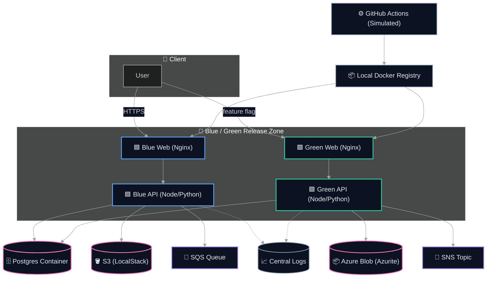
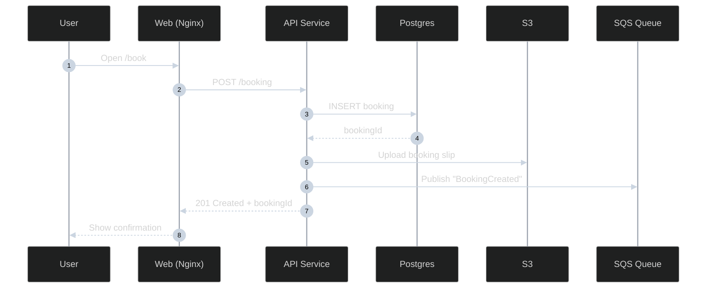
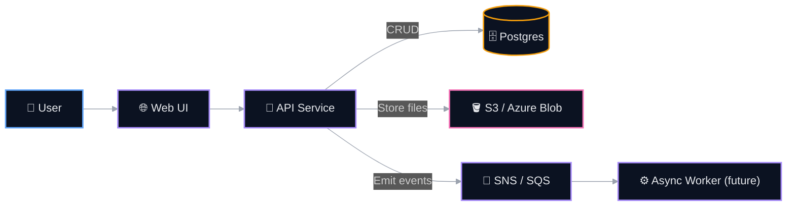

# IndoorApp Architecture

This document captures the entire technical landscape of IndoorApp, from its current on-prem setup to the cloud-ready simulated architecture with blue/green deployments.
---

## 1. As-Is Architecture — The On-Prem Castle 🏰

```mermaid
%%{init: {"theme":"dark","themeVariables":{
  "background":"transparent",
  "primaryColor":"#0B1221","primaryBorderColor":"#8BA3BE","primaryTextColor":"#E5E7EB",
  "secondaryColor":"#111827","secondaryBorderColor":"#64748B","tertiaryColor":"#1F2937",
  "lineColor":"#9CA3AF","edgeLabelBackground":"#111827"
}} }%%
flowchart LR
  U["👥 End Users (Employees / HR)"]
  W["🧱 IndoorApp Monolith (IIS / Apache)"]
  DB[("🗄️ On-Prem DB Server")]
  FS[("📂 On-Prem File Share")]
  AD["🔐 Corp AD / LDAP"]

  U -->|HTTPS| W
  W --> DB
  W --> FS
  W --> AD

  subgraph OnPremDC["🏰 On-Prem DC (The Old Kingdom)"]
    W
    DB
    FS
    AD
  end

  classDef svc fill:#0F172A,stroke:#60A5FA,stroke-width:1.6px,color:#E5E7EB;
  classDef data fill:#1F2937,stroke:#F59E0B,stroke-width:1.6px,color:#FDE68A;
  classDef idp fill:#1F2937,stroke:#F472B6,stroke-width:1.6px,color:#FBCFE8;

  class W svc;
  class DB,FS data;
  class AD idp;

  style OnPremDC fill:#0B1221,stroke:#64748B,stroke-width:1.2px,rx:8px,ry:8px;
```

---

## 2. To-Be Architecture — Cloud Simulation City 🌆

---

## 3. Deployment View — Local Mini-Cloud Blueprint 🗺️

```mermaid
%%{init: {"theme":"dark","themeVariables":{"background":"transparent","lineColor":"#9CA3AF"}} }%%
graph TD
  subgraph Laptop["💻 Dev / PM Laptop"]
    VS["VS Code + Docker Desktop"]
    LS["LocalStack"]
    AZ["Azurite"]
    REG["Local Docker Registry"]
  end

  subgraph Runtime["🟦🟩 Local Blue-Green Runtime"]
    WEB_B["🟦 Web (Blue)"]
    API_B["🟦 API (Blue)"]
    WEB_G["🟩 Web (Green)"]
    API_G["🟩 API (Green)"]
    PG[("🗄️ Postgres")]
  end

  VS --> REG
  REG --> WEB_B
  REG --> API_B
  REG --> WEB_G
  REG --> API_G
  API_B --> LS
  API_G --> AZ
  API_B --> PG
  API_G --> PG

  classDef runtime fill:#0B1221,stroke:#64748B,stroke-width:1.2px;
  classDef blue fill:#0B1221,stroke:#60A5FA,stroke-width:2px;
  classDef green fill:#0B1221,stroke:#34D399,stroke-width:2px;
  classDef db fill:#0B1221,stroke:#F59E0B,stroke-width:2px;

  class WEB_B,API_B blue;
  class WEB_G,API_G green;
  class PG db;
  class Laptop,Runtime runtime;
```

---

## 4. Sequence: Book a Room — A Tiny Journey 🚶‍♂️🏨

---

## 5. Data Flow — IndoorApp

---

## Legend 🗝️
- 🟦 **Blue** = Current live service
- 🟩 **Green** = New version warming up
- 🏰 **On-Prem** = Old world
- 🌆 **Cloud Simulation** = New world
- **Cylinders** = Databases
- **Purple** = Async messaging
- **Pink** = File/Object storage
