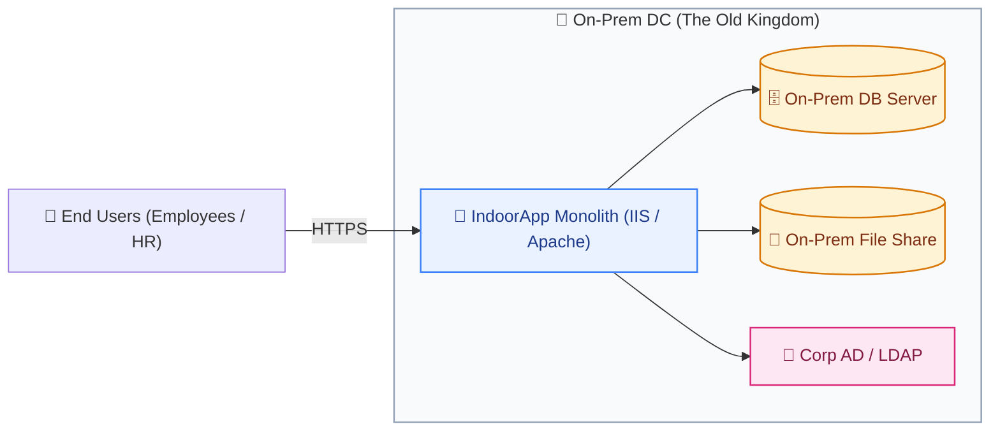
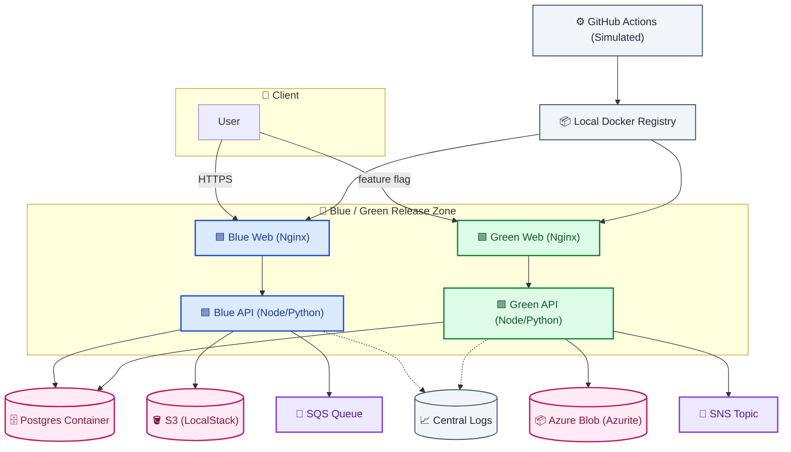
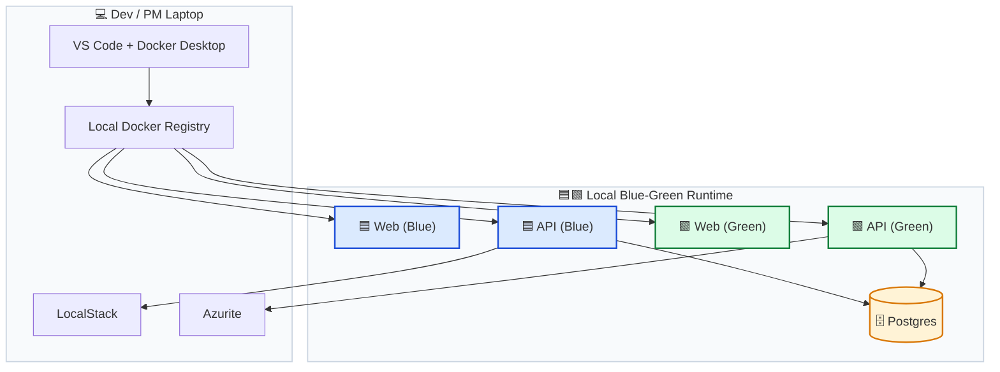
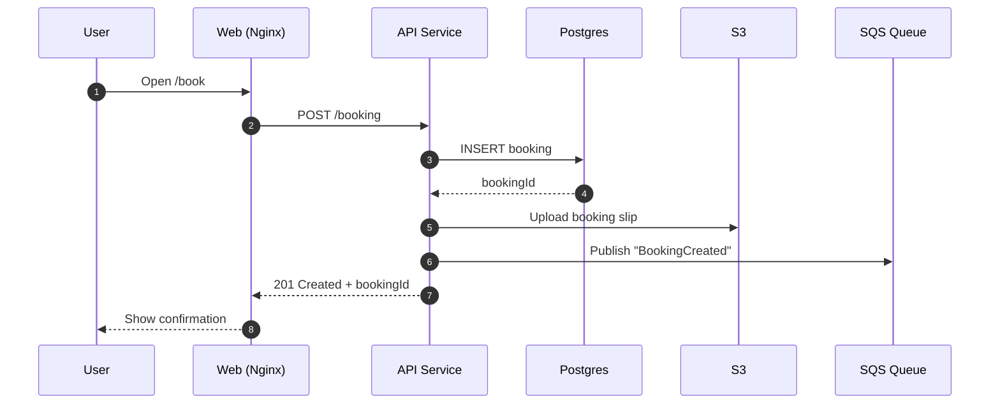
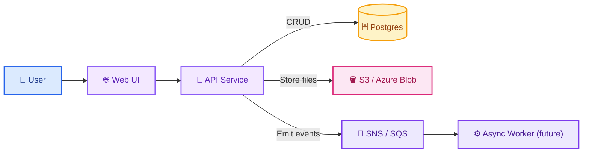

# IndoorApp Architecture

IndoorApp is a story about a small on-prem monolith that grows wings and learns to fly in a locally simulated cloud.
This document shows every chapter — from old-world castles to blue-green skylines.

---

# 1. As-Is Architecture — The On-Prem Castle 🏰

---

# 2. To-Be Architecture — Cloud Simulation City 🌆

---

# 3. Deployment View — Local Mini-Cloud Blueprint 🗺️

---

# 4. Sequence: Book a Room — A Tiny Journey 🚶‍♂️🏨

---

# 5. Data Flow — IndoorApp

---

# 6. Notes & Legend 🗝️

## Release Colors
- 🟦 **Blue** = Current live service  
- 🟩 **Green** = New version warming up  

## Worlds
- 🏰 **On-Prem** = The old kingdom  
- 🌆 **Cloud Simulation** = The new skyline  

## Visual Language
- **Cylinders** = Databases  
- **Purple** = Async messaging  
- **Pink** = File/Object storage  

---

